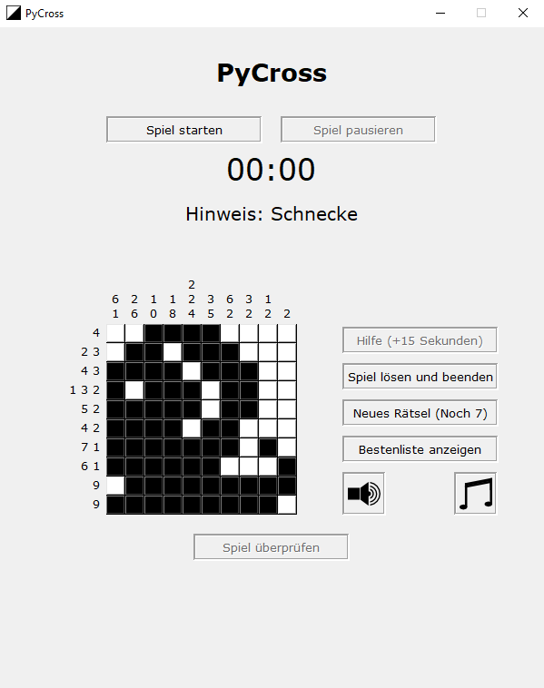

# PyCross

## A Nonogramm Game for Python

## How to play

Simply start the main.py file and enjoy.

## Always take a look at the Hinweis: it will give you a hint!

You can select out of ten challenging nonogramm puzzles which will be assigned in
a randomly order.

### To start a new game press "Spiel starten"
During a running game the button will change to allow you to restart the game.
### To pause a game anytime press "Spiel pausieren"
While pause the button will change to let you continue the game.
### Once you are stuck feel free to the use the button "Hilfe"
But be aware it will add 15 seconds penalty time.
### Feeling stuck in the current game?
Just press "Spiel lösen und beenden" and it will immediately solve and finish the game.
### Switch trough all available games with "Neues Rätsel"
The buttons shows you how many remaining games are available
### Take a look at the Bestenliste by pressing "Bestenliste anzeigen"
It will open in a new window.
### Think you have the correct solution? Press "Spiel überprüfen"
It will show you how many errors still exist or open a window to insert your name when the
solution is correct.

### Game Control

You can disable or enable sound and music individually at anytime during the game.
Just click on the speaker icon for sound and the music note for music.

# Credits
developed and tested with Python 3.9 and Windows 10\
by Frederik Knosalla and Boris Roßbach

Please refer to file requirements.txt for necessary modules

## source paths for used sound
Winsound: https://freesound.org/people/LittleRobotSoundFactory/sounds/270319/ \
Errorsound: https://freesound.org/people/distillerystudio/sounds/327735/ \
Musik: https://www.bensound.com/royalty-free-music/track/better-days/ \
Click: https://www.fesliyanstudios.com/play-mp3/5 

## source path for nonogramms
http://nonogramskatana.blogspot.com/search/label/10x10

## icons 
by Frederik Knosalla
